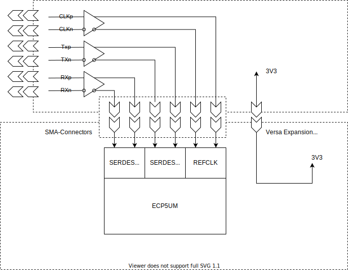

# ECP5_PCIE_Analyzer
The main idea of this project is the evaluation of the possibility of using the PCS-Block of ECP5UMG FPGA for PCI-Express protocol analysis.
The PCS Block can deserialize physical PCI-Express signals and decode 8b10b. 

Deserialized data can be used to analyze protocol traffic, detecting errors and so on.

The first implementation involves an adapter print to connect PCI-Express lanes to PCS-Block in FPGA and an evaluation board with ECP5UM(G).

The adapter print should be connected to the eval. board through VERSA Expansion headers and SMA-Cables.

https://www.latticesemi.com/products/developmentboardsandkits/ecp5evaluationboard
# VERSA Expansion Headers

# Eval Board top view

# Eval Board bottom view

## Impedance calculation JLCPCB

