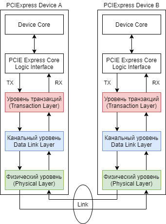
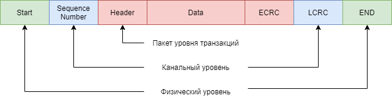
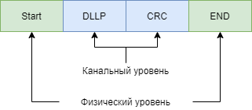

# PCIExpress 2.5GT/s analyzer своими руками

А не попробовать ли нам сделать PCI-Express анализатор?
Цены на профессиональные анализаторы не доступны простому разработчику, да и зачастую неподъёмны даже для небольших фирм. Хотя для целей диагностики и обучения возможно создание бюджетного прибора, который, хоть и будет уступать префессиональному устройству, но всё же позволит комфортно работать с PCIExpress протоколом. В данной статье я предлагаю описание первого устройства, созданного для проверки концепции. В ней содержится краткое описание архитектуры PCIExpress, общая идея проекта, результаты реализации и тестирования первого прототипа.

## Кратко о том, как работает PCIExpress.
### Физическая среда передачи данных
PCIExpress шина это физическое соединение типа точка-точка, состоящее из х1, х2, х4, х8, х12, х16 или х32 каналов связи. Один канал связи представляет собой две дифференциальные пары, работающие одна на приём, другая на передачу данных. То есть х1-канал работает по 4 проводникам, а каналу х-32 необходимо уже 128. Каналы связи всегда симметричны - то есть количество пар в обоих направлениях одинаково.
Физически по каналу передаётся дифференциальный сигнал амплитудой от 800мВ до 1200мВ, постоянаая составляющая сигнала может варьироваться от 0 до 3.6В на стороне передатчика. Передатчик отвязан по постоянному току от приёмника с помощью конденсаторов. Частота передаваемого по каналам сигнала зависит от версии PCIExpress-протокола (Таблица 1). 

Версия протокола     | Частота передачи | Скорость передачи данных
-----------|---------|-----------
PCIe 1.0   |2.5GHz   | 250MB/s   
PCIe 2.0   | 5GHz    |500МБ/с    
PCIe 3.0   | 8GHz    |985МБ/с
PCIe 4.0   | 16GHz   |1969ГБ/с
PCIe 5.0   | 32GHz   |3938ГБ/с

*Таблица 1. Версии PCIExpress*

### Пакетная передача данных
PCIE спецификация определяет многоуровневую архитектуру. Эти уровни состоят из физического уровня (physical layer), канального уровня (data link layer) и уровня транцзакций (transaction layer) (Рисунок 1).

*Рисунок 1. Логические уровни PCIEXpress протокола*

Данные между устройствами передаются с помощью пакетов. Содержимое пакета формируется на уровне транзакций с использованием данных, полученных от ядра устройства и приложения. Такой пакет называется пакетом уровня транзакции (Transaction layer packet). Далее этот пакет поступает на уровень канала данных, где к нему присоединяется дополнительная информация, необходимая для проверки онибок на устройстве-приёмнике. Затем пакет кодируется на физическом уровне и передаётся по каналу связи приёмнику.
Физический уровень приёмника декодирует полученный пакет и отправляет обработанный покет по цепочке наверх. На канальном уровне этот пакет проверяется на отсутствие ошибок, и в случае успеха передаётся на уровень транзакций. Далее данные пакета обрабатвыаются таким образом, чтобы они могли быть приняты уровнем ядра и приложения. 

### TLP пакеты

Приложение или ядро отправляет на уровень транзакций информацию, требуемую для сборки  части TLP-пакета: заголовок и данные. Некоторые TLP-пакеты могут не содержать данных. Опционально возможно добавление дополнительного поля с End-to-End CRC (ECRC).
На канальном уровне к этому пакету добавляется счётчик пакетов и Link CRC (LCRC). Результат посылается на физический уровень, где к нему добавляется старт- и стоп символы длинной в 1 байт каждый. Пакет кодируется и передаётся по доступному количеству дифференциальных пар.

*Рисунок 2. Структура TLP пакета*

Приёмник проводит те же самые операции в обратном порядке. На каждом уровне отбрасываются соответстующие поля. И в конечном счёте данные приходят получателю.

### Data Link Layer пакеты (DLLP)

Помимо пакетов с данными, на канальном уровне осуществляется приём-передача пакетов, необходимых для управления потоком данных, подтверждения доставки пакетов (acknowledge/ no acknowledge) и управления питанием шины. Пакет состоит из поля данных уровня канала и контроля CRC. На физическом уровне DLLP-пакет так же дополняется старт- и стоп байтом.

*Рисунок 3. Структура DLLP пакета*

На стороне приёмника такой пакет после декодирования на физическом уровне попадает на уровень канала, и не транслируется на уровень транзакций.

### Physical Layer пакеты (PLP)

Ещё один вид пакетов - пакеты физического уровня. Они генерируются на физическом уровне протокола передатчика, и обрабатываются на том же уровне на стороне приёмника. PLP-пакеты очень просты по своей структуре, и состоят только из заголовка и трёх или более байт, которые определяют структуру пакета и содержат дополнительную информацию.

*Рисунок 4. PLP - пакет*

Некоторые из этих пакетов участвуют в установке соединения между устройствами, некоторые служат для поддержания синхронизации приёмника и передатчика во время отсутствия нагрузки в виде данных на шине.

Основным компонентом анализатора явлеяется ПЛИС фирмы Lattice серии ECP5UM. ECP5UM имеет в своём распоряжении до четырёх PCS (Physical Coding Sublayer), которые умеют работать с физическим уровнем PCIE, GbE, SGMII и прочими протоколами, декодируют на лету 8b10b.
Основная идея работы устройства заключается в следующем. Каналы приёма PCS подключаются через ограничивающие усилители к линиям TX и RX PCIExpress-шины. Блок PCS декодирует поток данных, и на его выходе мы получаем сырые данные PCIExpress. 

Анализатор должен уметь декодировать 8b10b поток, дескремблировать полученные данные, распознавать начало и конец пакетов, 