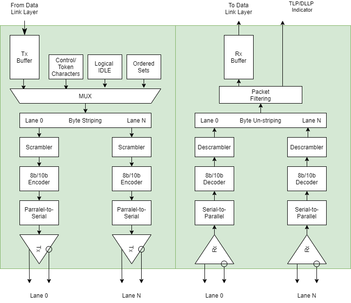
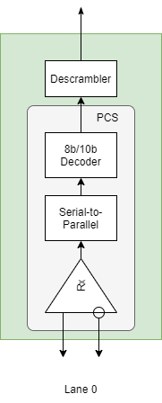

# PCIExpress 1.0 2.5GT/s analyzer своими руками

А не попробовать ли нам сделать PCI-Express анализатор?
Цены на профессиональные анализаторы не доступны простому разработчику, да и зачастую неподъёмны даже для небольших фирм. Хотя для целей диагностики и обучения возможно создание бюджетного прибора, который, хоть и будет уступать префессиональному устройству, но всё же позволит комфортно работать с PCIExpress протоколом. В данной статье я предлагаю описание первого устройства, созданного для проверки концепции. В ней содержится краткое описание архитектуры PCIExpress, общая идея проекта, результаты реализации и тестирования первого прототипа.

## Кратко о том, как работает PCIExpress.
### Физическая среда передачи данных
PCIExpress шина это физическое соединение типа точка-точка, состоящее из х1, х2, х4, х8, х12, х16 или х32 каналов связи. Один канал связи представляет собой две дифференциальные пары, работающие одна на приём, другая на передачу данных. То есть х1-канал работает по 4 проводникам, а каналу х-32 необходимо уже 128. Каналы связи всегда симметричны - то есть количество пар в обоих направлениях одинаково.
Физически по каналу передаётся дифференциальный сигнал амплитудой от 800мВ до 1200мВ, постоянаая составляющая сигнала может варьироваться от 0 до 3.6В на стороне передатчика. Передатчик отвязан по постоянному току от приёмника с помощью конденсаторов. Частота передаваемого по каналам сигнала зависит от версии PCIExpress-протокола (Таблица 1). 

Версия протокола     | Частота передачи | Скорость передачи данных
-----------|---------|-----------
PCIe 1.0   | 2.5GHz  | 250MB/s   
PCIe 2.0   | 5GHz    |500МБ/с    
PCIe 3.0   | 8GHz    |985МБ/с
PCIe 4.0   | 16GHz   |1969ГБ/с
PCIe 5.0   | 32GHz   |3938ГБ/с

*Таблица 1. Версии PCIExpress*

Для синхронизации работы устройств, помимо сигналов с данными, по отдельной паре передаётся тактирующая частота 100 МГц.

### Пакетная передача данных
PCIE спецификация определяет многоуровневую архитектуру. Эти уровни состоят из физического уровня (physical layer), канального уровня (data link layer) и уровня транцзакций (transaction layer) (Рисунок 1).

*Рисунок 1. Логические уровни PCIEXpress протокола*

Данные между устройствами передаются с помощью пакетов. Содержимое пакета формируется на уровне транзакций с использованием данных, полученных от ядра устройства и приложения. Такой пакет называется пакетом уровня транзакции (Transaction layer packet). Далее этот пакет поступает на уровень канала данных, где к нему присоединяется дополнительная информация, необходимая для проверки ошибок на устройстве-приёмнике. Затем пакет кодируется на физическом уровне и передаётся по каналу связи приёмнику.
Физический уровень приёмника декодирует полученный пакет и отправляет обработанный пакет по цепочке наверх. На канальном уровне этот пакет проверяется на отсутствие ошибок, и в случае успеха передаётся на уровень транзакций. Далее данные пакета обрабатвыаются таким образом, чтобы они могли быть приняты уровнем ядра и приложения. 

Рассмотрим три основных типа пакетов PCIExpress протокола подробнее.

### Transaction layer Packets (TLP) пакеты уровня транзакций

Приложение или ядро отправляет на уровень транзакций информацию, требуемую для сборки  части TLP-пакета: заголовок и данные. Некоторые TLP-пакеты могут не содержать данных. Опционально возможно добавление дополнительного поля с End-to-End CRC (ECRC), которое может использоваться для проверки правильности доставки сообщения приложением.
На канальном уровне к этому пакету добавляется счётчик пакетов и Link CRC (LCRC). Результат посылается на физический уровень, где к нему добавляется старт- и стоп символы длинной в 1 байт каждый. Пакет кодируется и передаётся по доступному количеству дифференциальных пар.

*Рисунок 2. Структура TLP пакета*

Приёмник проводит те же самые операции в обратном порядке. На каждом уровне отбрасываются соответстующие поля. И в конечном счёте данные приходят получателю.

### Data Link Layer Packets (DLLP) пакеты уровня канала

Помимо пакетов с данными, на канальном уровне осуществляется приём-передача пакетов, необходимых для управления потоком данных, подтверждения доставки пакетов (acknowledge/ no acknowledge) и управления питанием шины. Пакет состоит из поля данных уровня канала и контроля CRC. На физическом уровне DLLP-пакет так же дополняется старт- и стоп байтом.

*Рисунок 3. Структура DLLP пакета*

На стороне приёмника такой пакет после декодирования на физическом уровне попадает на уровень канала, и не транслируется на уровень транзакций. Доступ к пакетам уровня канала доступен пользователю лишь косвенно - через конфигурирование PCIE - ядра и в виде регистров или сигналов статуса шины.

### Physical Layer Packets (PLP) пакеты физического уровня 

Ещё один вид пакетов - пакеты физического уровня. Они генерируются на физическом уровне протокола передатчика, и обрабатываются на том же уровне на стороне приёмника. PLP-пакеты очень просты по своей структуре, и состоят только из заголовка и трёх или более байт, которые определяют структуру пакета и содержат дополнительную информацию.

*Рисунок 4. PLP - пакет*

Некоторые из этих пакетов участвуют в установке соединения между устройствами, некоторые служат для поддержания синхронизации приёмника и передатчика во время отсутствия нагрузки в виде данных на шине.

### Физичееский уровень протокола PCIExpress Gen 1 и Gen 2

Описание полной логики работы PCIExpress выходит за рамки одной статьи. Но для объяснения принципа работы анализатора рассмотрим структуру физического уровня протокола. На рисунке 5 отображена упрощённая блок-схема. На нем показаны следующие элементы приёмника и передатчика:
 - Буфферы пакетов (Tx Buffer/ Rx Buffer)
 - Мультиплексоры(Mux)
 - Логика упаковки/ распаковки байт (Byte (Un-)stripping)
 - Скремблер и дескремблер
 - 8b/10b кодер и энкодер
 - Сериализатор - десериализатор.
 
 

*Рисунок 5. Структурная схема физического уровня протокола*

TLP или DLLP пакеты попадают из канального уровня в буффер физического уровня. С помощью мультиплексора пакет дополняется стартовым и стоповым символами, которые используются приёмником для определения границ пакета в потоке. Готовый фрейм (пакет и управляющие старт-стоп символы) отправляется логике, которая разбивает байты на отдельные каналы, в случае, если протокол работает более чем по одному каналу (х2, х4 и т.д.).
Все байты во фрейме, за исключением управляющих, скремблируются (скремблирование можно отключать в настройках PCIExpress) и дополняются двумя дополнительными битами в 8b/10b кодере. Подробно разбирать принцип работы кодера не буду. Упомяну лишь, что в 8b/10b коде получается расширить поток данных специальными управляющими символами. Таким образом, байты на входе кодера получают специальный управляющий К-флаг, по которому в нашем случае определяются старт- и стоп байты во фрейме.

|D или K символ|HEX байт|отдельные биты|название байта|CRD-|CRD+|
|-|-|-|-|-|-|
|Data(D)|6A|011 01010|D10.3|010101 1100| 010101 0011|
|Data(D)|1B|000 11011|D27.0|110110 0100| 001001 1011|
|Data(D)|F7|111 10111|D23.7|111010 0001| 000101 1110|
|Control(K)|F7|111 10111|K23.7|111010 1000| 000101 0111|
|Control(K)|BC|101 11100|K28.5|001111 1010|110000 0101|

*Таблица 2. Пример 8b/10b кодирования*

Как уже говорилось, К-Символы в потоке данных сигнализируют о границах пакета. К таким символам относятся:
|Название байта|HEX значение|Функция|
|-|-|-|
|K23.7|0xF7|PAD; used in framing and link width and lane ordering negotiations
|K27.7|0xFB|Start TLP; Marks the start of a transaction layer packet
|K28.0|0x1C|Skip; used for compensating for different bit rates 
|K28.1|0x30|Fast Training Sequence; Used within a ordered set to exit from L0s to L0
|K28.2|0x5C|Start DLLP; marks the start of a data link layer packet
|K28.3|0x7C|Idle; used in the electrical idle ordered set
|K28.5|0xBC|Comma; used for lane and link initialization and management
|K28.7|0xFC|Electrical Idle Exit; Reserved in 2.5 GT/s
|K29.7|0xFD|End; marks the end of a TLP packet or DLLP packet
|K30.7|0xFE|End Bad; marks the end of nullified TLP

*Таблица 3. К-символы, используемые в PCIExpress-протоколе*

Кодированный фрейм поступает на вход сериалайзера и через драйвер дифференциальной шины на выход устройства.

В приёмнике фрейм проходит те же шаги, но в обратном порядке. Дифференциальный сигнал со входа устройства преобразуется драйвером и подаётся на десериалайзер. 10-битный сигнал расшифровывается 8b/10b декодером, где вычленяются управляющие байты и байты потока данных. D-символы потока данных поступают на дескремблер, а К-символы синхронизируют его работу. Отдельные байты разных физических каналов упаковываются в один пакет, фильтруются по типу, и поступают в буффер обмена с верхним, канальным уровнем.

## Описание принципа работы анализатора

Это, конечно, очень поверхностное описание работы протокола. Но оно даёт приблизительное представление о том, как проще всего создать анализатор шины. Надо "вклиниться" в линии передачи между устройствами, расшифровать поток и полученные пакеты передать на обработку программе. 
Для расшифровки потока отлично подходит ПЛИС фирмы Lattice - ECP5UM. Эти ПЛИСы имеют в своём распоряжении до четырёх PCS (Physical Coding Sublayer), которые умеют работать с физическим уровнем PCIE, GbE, SGMII и прочими протоколами, декодируют поток 8b10b.
ECP5UM работает с версией протокола Gen 1, а ECP5UMG - с версией протокола Gen 1 и Gen 2.
Подключив Rx и Tx линии, соединяющие два PCIExpress устройства, к приёмникам PCS ПЛИС, можно декодировать поток, получая фреймы физического, канального уровней, и уровня транзакций.
Логику работы схемы можно создать таким образом, чтобы фильтровать ненужные пакеты, настраивать триггеры на определённые события, сохранять данные и время их получения/отправки.

Для проверки работоспособности этой идеи планировалось использовать отладочную плату LFE5UM5G-85F-EVN. На этой плате все входы и выходы PCS подключены к внешним коаксиальным разъёмам SMA. Для подключеия к штырьковым разъёмам, расположенным на плате, была разработана плата-мезонин с ограничивающими дифференциальными операционными усилителями. Входы операционных усилителей должны подключаться к PCIExpress - контактам устройств. Выходы через коаксиальные кабели соединяться с приёмниками ПЛИС. 

К сожалению из-за дефицита электронных компонентов не получилось добыть эту отладочную плату, и заместо неё для прототипирования пришлось использовать имеющуюся в наличии плату ECP5 Versa Development Board. Вместо ECP5UMG на этой плате установлен ECP5UM, и один из каналов PCS подключен к Card Edge PCIExpress разъёму. И лишь один канал приёмо-передатчика выведен на SMA-разъём. Поэтому при тестировании устройства получилось проверить работоспособность только одного канала.

Разработанная плата-мезонин сделана достаточно просто. На ней установленны три усилителя, SMA-разъёмы для соединения с отладочной платой. Для подключения PCIExpress устройств используется плоский кабель с дифференциальными парами от 3М. Кабель распаивается с одной стороны на плату-мезонин, а с другой стороны его можно монтировать на различные адаптеры - к примеру стандартный PCIExpress, или MiniPCIE. В моём случае это разъём, к которому можно было устройства, разрабатываемые на нашей фирме.

## Проект для ПЛИС

### Проект 

Основной задачей ПЛИС является декодирование физического интерфейса двух каналов TX и RX. Декодированные с помощью десериалайзеров и дескремблированные данные поступают на ввход анализатора, где выполняется определение границ фреймов и распознавание типов пакетов. Данные с анализатора поступают в кольцевой буффер. 
Управление устройством осуществляется через блок контроллера. В данном прототипе связь с анализатором, настройка и считывание данных работает по шине SPI.
Контроллер отвечает за работу устройства - с его помощью можно устанавливать триггер, по которому данные будут сохраняться в памяти, настраивать фильтры пакетов. А так же считывать данные из блока памяти и передавать их для дальнейшей обработки.

### Блок Анализатора

*Рисунок 6. PCS*
 

